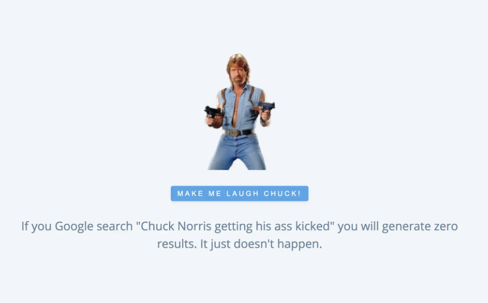
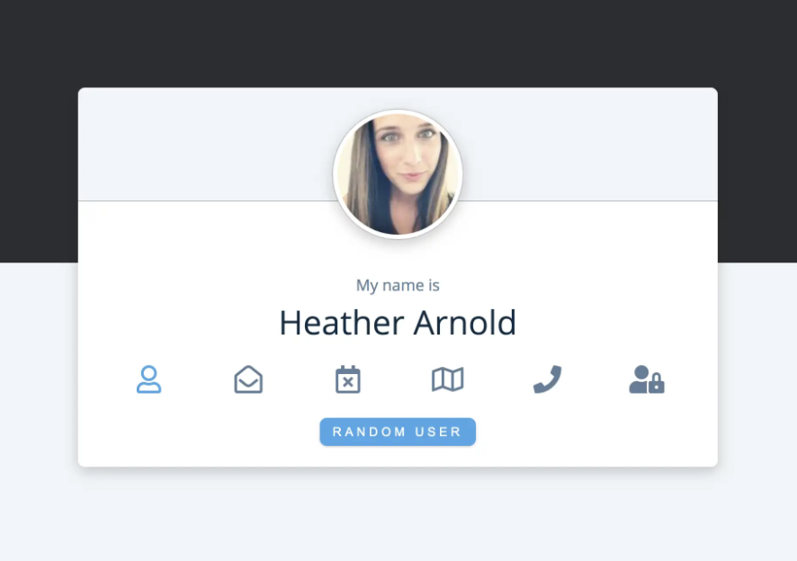
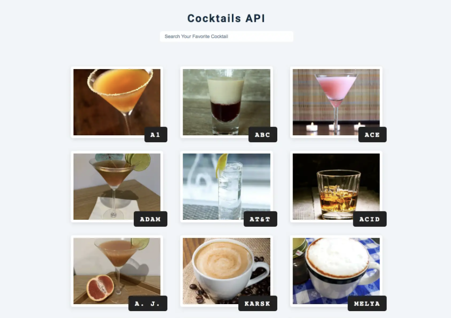
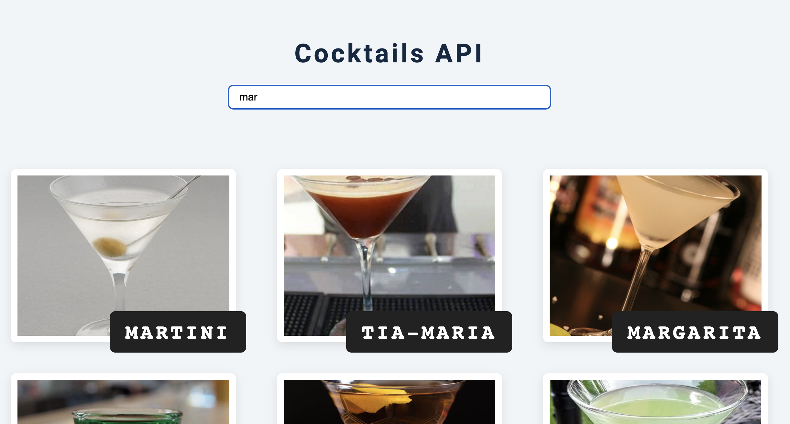
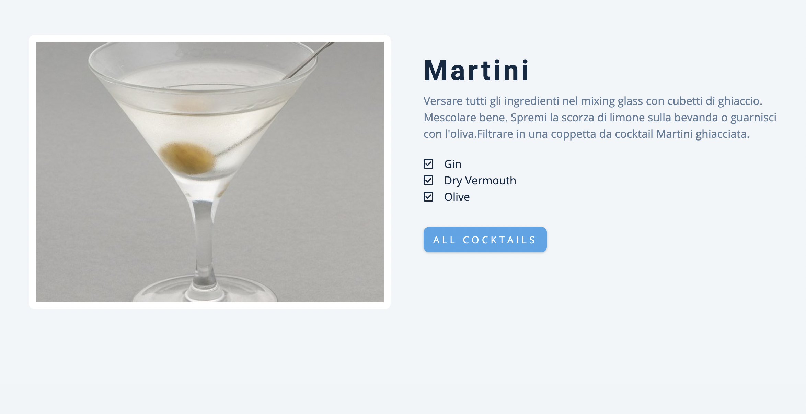
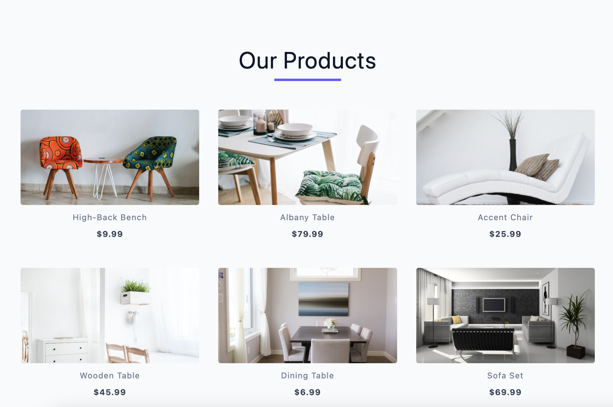
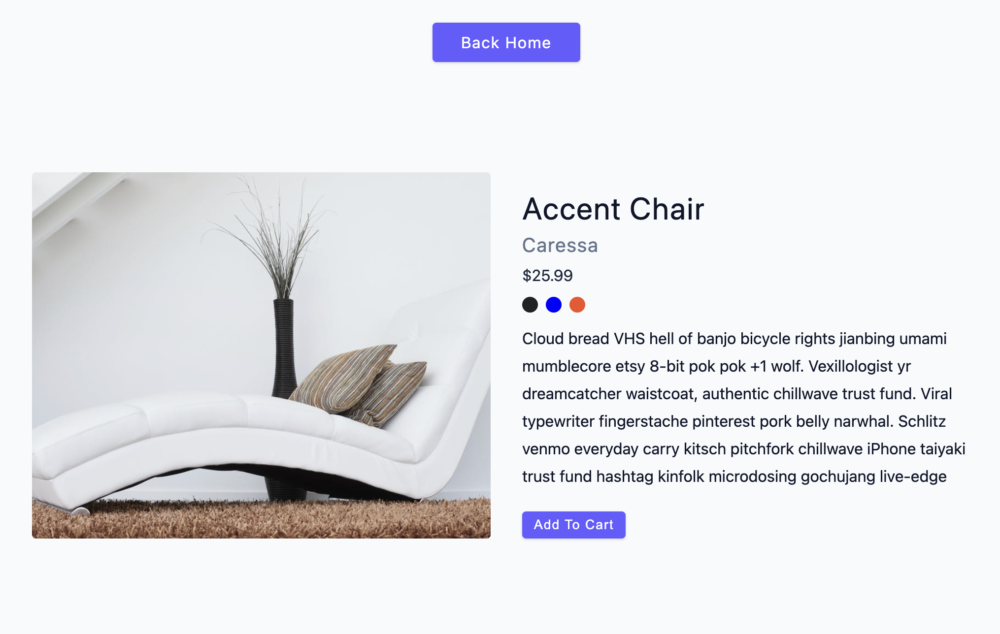
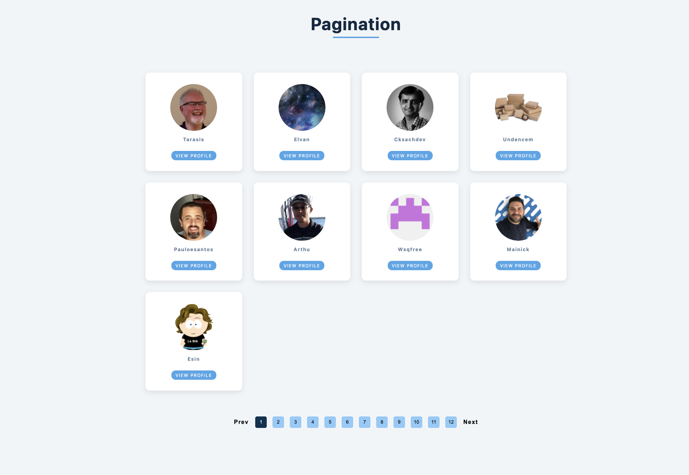

## Vanilla JS basic AJAX projects

[Part of John Smilga's JS Tutorial](https://www.udemy.com/course/javascript-tutorial-for-beginners-w/)

#### You can see all projects in action here

[Projects](https://www.vanillajavascriptprojects.com/)

1. Chuck Norris random jokes generator

- We have a button and every time we click the button we will hit the Api and display a random joke. The image will shake for a random amount of time.
- It is an exercise project where we first work with XMLHttpRequest (XHR) object, then with promises, fetch and async/await.

    

2. Random user card

- We have a card, where we display data (image, name, age, different icons for phone, email etc.). Displaying icons info dynamically.
- Using JS modules
- Using Random User Generator API: https://randomuser.me

    

3. Cocktails Api

- Search for your favourite cocktail by typing the name in the search form; event on when we are typing
- When clicked on a cocktail, detail page is opening. Using locale storage to pass data between modules
- External Api: https://www.thecocktaildb.com

    

    

    

4. Products Api

- Fetch products from an API, display them on the home page. On click on the certain product we open a detailed product page. We fetch a detailed info about the specific product.

    

    

4. Products Api

- Fetching github followers and set up pagination, so that 10 people are displayed per page. Dynamically changing the number of displayed people. Working with modules.
- Prev and next page buttons

    

